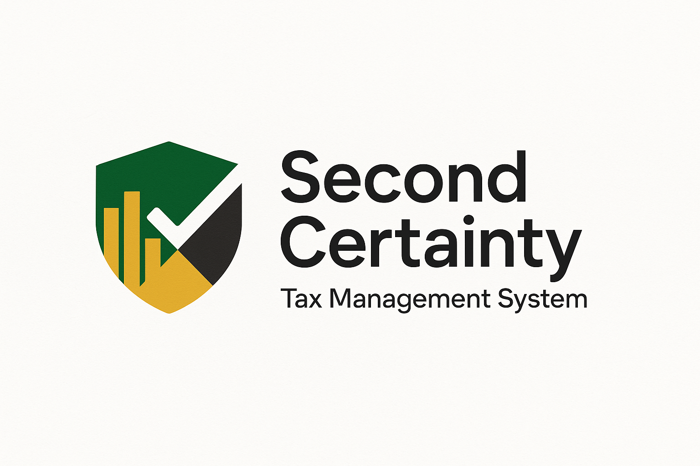

# Second Certainty - Tax Management System

A comprehensive South African tax liability management system that helps users track, calculate, and optimize their tax obligations throughout the fiscal year.



## Live Demo

- **Frontend Application**: [https://second-certainty.onrender.com](https://second-certainty.onrender.com)
- **Backend API**: [https://second-certainty-api.onrender.com](https://second-certainty-api.onrender.com)
- **API Documentation**: [https://second-certainty-api.onrender.com/api/docs](https://second-certainty-api.onrender.com/api/docs)

> **Note**: The application is deployed on Render's free tier, which may result in slow initial load times after periods of inactivity.

## Overview

The Second Certainty Tax Tool addresses one of life's two certainties—taxes—by providing individuals and small businesses with an intuitive platform for managing tax liabilities throughout the fiscal year. Traditional tax management often occurs reactively at year-end, leading to unexpected liabilities, missed deductions, and financial stress.

Our application transforms this approach by implementing a proactive, year-round tax management system that continuously calculates estimated tax liabilities based on income streams, identifies potential deductions, forecasts quarterly payments, and provides optimization strategies—all in real-time.

## Features

- **User Authentication**: Secure JWT-based authentication system
- **Profile Management**: Create and manage user tax profiles
- **Income Tracking**: Log multiple income sources (salary, freelance, investments, etc.)
- **Expense Management**: Record and categorize tax-deductible expenses
- **Real-time Tax Liability**: Calculate current tax position at any time
- **Tax Data**: Up-to-date tax brackets, rebates, thresholds
- **SARS Integration**: Automatic scraping of latest tax rates from SARS website
- **Provisional Tax**: Calculate and track provisional tax payments
- **Data Validation**: Comprehensive input validation and error handling
- **Visualizations**: Charts and graphs for income, expenses, and tax projections

## Documentation

For more detailed information, please refer to the following documentation:

- [Installation Guide](./INSTALLATION.md): Setup instructions for local development
- [Deployment Guide](./DEPLOYMENT.md): Instructions for deploying to production
- [API Documentation](./API.md): Details on available endpoints and usage
- [Frontend Documentation](./FRONTEND.md): Overview of frontend architecture and components
- [Contributing Guidelines](./CONTRIBUTING.md): How to contribute to the project

## Technology Stack

### Backend
- **Framework**: FastAPI 0.110.1
- **ORM**: SQLAlchemy 2.0.40
- **Validation**: Pydantic 2.6.0
- **Database**: PostgreSQL (or SQLite for development)
- **Authentication**: JWT with password hashing
- **Testing**: Pytest 7.4.4
- **Documentation**: OpenAPI (Swagger UI)
- **HTTP Client**: HTTPX 0.27.0
- **Server**: Uvicorn 0.29.0

### Frontend
- **Framework**: React 18.2
- **Routing**: React Router 6.22.1
- **HTTP Client**: Axios 1.6.7
- **State Management**: React Context API
- **Styling**: Tailwind CSS 3.4.1
- **Data Visualization**: Recharts 2.12.0
- **Build Tools**: Create React App

## Quick Start

### Backend

```bash
# Clone the repository
git clone https://github.com/ces0491/second-certainty.git
cd second-certainty

# Create virtual environment
python -m venv venv
source venv/bin/activate  # On Windows: venv\Scripts\activate

# Install dependencies
pip install -r requirements.txt

# Create environment file
cp .env.example .env
# Edit .env with your configuration

# Initialize database
python init_db.py
python scripts/seed_data.py

# Start development server
uvicorn app.main:app --reload
```

### Frontend

```bash
# Navigate to frontend directory
cd path/to/frontend

# Install dependencies
npm install

# Start development server
npm start
```

See the [Installation Guide](./INSTALLATION.md) for more detailed instructions.

## License

This project is licensed under the MIT License - see the [LICENSE](./LICENSE) file for details.

## Acknowledgements

- South African Revenue Service (SARS) for providing tax information
- The FastAPI team for the API framework